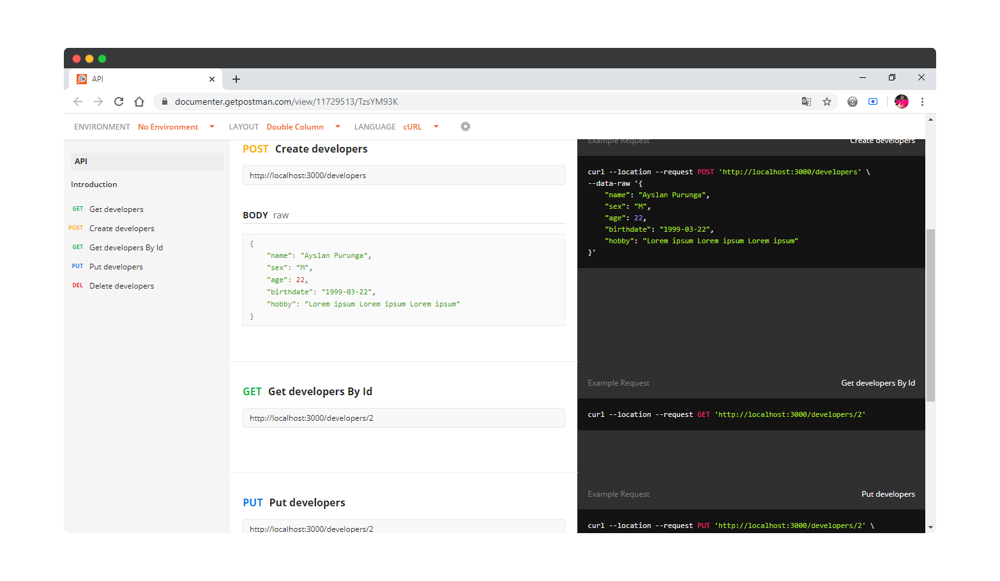
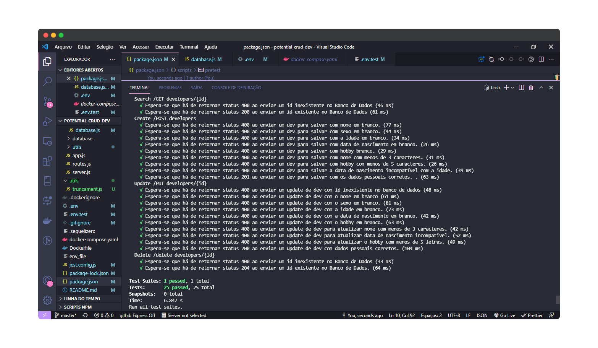

# potential_crud_dev

- Potencial para um CRUD de Devs

## Baixar as imagens e subir o container no Docker

```
    docker-compose up -d --build
```

## Para acessar o container do node

```
   docker container exec -it potential_crud_dev bash
```

## Quando acessar o container, executar o seguinte comando para rodar as migrations:

```
    npx sequelize-cli db:migrate
```

## Documetação da API:

- [DocumentationInPostman](https://documenter.getpostman.com/view/11729513/TzsYM93K)



## Testes Unitários:
#### Como executar:

```
    npm run test
```



## Redes Sociais:

- [Linkedin](https://www.linkedin.com/in/ayslan-fernandes-da-silva-5aa617171/)
- [Twitter](https://twitter.com/Ayslan_FS)
